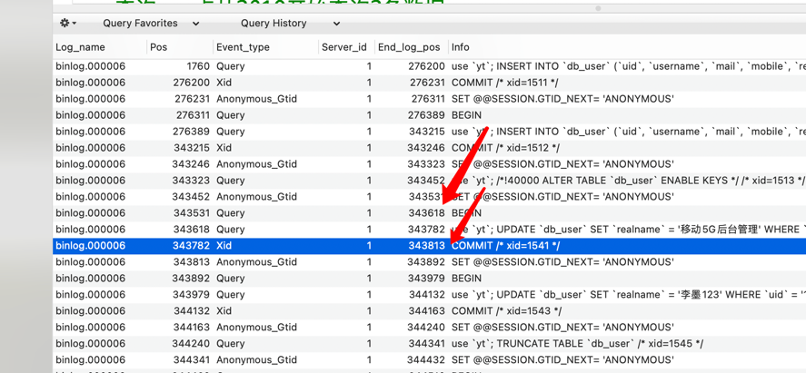

## mysql binlog日志及备份恢复

- **my.cnf 配置说明**
    - 模式 binlog_format=MIXED
      * ROW 
        记录每一行数据被修改的情况，但是日志量太大
        
      * STATEMENT
        记录每一条修改数据的SQL语句，减少了日志量，但是SQL语句使用函数或触发器时容易出现主从不一致
        
      * MIXED
        结合了ROW和STATEMENT的优点，根据具体执行数据操作的SQL语句选择使用ROW或者STATEMENT记录日志
      
    - log-bin路径&前缀
        * 配置log-bin=/Applications/MxSrvs/bin/mysql/data/binlog-data/binlog
          - 路径：/Applications/MxSrvs/bin/mysql/data/binlog-data/
          - 前缀：binlog ，日志储存前缀 如：binlog.000001 binlog.000002
        
    - 其他配置
      
        ```text
        #模式
        binlog_format=MIXED
        #路径&前缀
        log-bin=/Applications/MxSrvs/bin/mysql/data/binlog-data/binlog
          
        #超过7天的binlog将被删除，防止binlog文件占用过多磁盘空间
        expire_logs_days = 7
          
       ```
    
- 查询binlog日志内容

    ```mysql
        
      -- 查询某个binlog内容
      show binlog events in 'binlog.000001';
    
      -- 查询pos点从2810开始查询
      show binlog events in 'binlog.000001' from 2810;
    
      -- 查询pos点从2810开始查询2条数据
      show binlog events in 'binlog.000001' from 2810 limit 2;
    
      -- 查询pos点从2810开始查询跳过两条数据查询4条数据
      show binlog events in 'binlog.000001' from 2810 limit 2,4;
  
      -- 通过info可分析出具体操作  
    ```

- **binlog 常用命令**
  
    ```text
        binlog日志文件为二进制文件无法通过cat、less等命令查看
        mysqlbinlog --base64-output=decode-rows -v /var/lib/mysql/mysql-bin.000001;
        
        查看日志开启状态
        show variables like 'log_%'
        
        查看所有binlog日志列表 
        show master logs;
        
        查看最新一个binlog日志的编号名称，及其最后一个操作事件结束点
        show master status;
        
        清空所有binlog日志
        reset master;
  
        创建一个新的日志文件，这样新的操作都写入到这个文件中
        flush logs;
     
    ```
  
  - **binlog 恢复数据**
    - 通过pos恢复
      ```shell
      #执行命令
      
      mysqlbinlog --start-position=2810 --stop-position=344546 --database=yt ./binlog.000001 | mysql -uroot -p123456 -v yt
      
      #整个命令的含义是通过mysqlbinlog读取日志内容并通过管道传给mysql命令，-v表示执行此mysql命令
      
      mysqlbinlog --start-datetime="2021-12-22 16:07:37" --stop-datetime="2021-12-22 16:09:23"  --database=yt  ./binlog.000005 | mysql -uroot -p  -v yt>./aaa.sql
      #将结果存入aaa.sql
      
      ```
      - 
      - --start-position 开始pos,一般对应end_log_pos BEGIN对应的值，如上图 343618
      - --stop-position 结束pos,一般对应end_log_pos COMMIT的值，如上图 343813
      - --database 数据库名称
    
  - 通过时间恢复
      ```shell
         mysqlbinlog --base64-output=decode-rows -v /var/lib/mysql/mysql-bin.000001
         #通过此命令分析具体时间，时间范围可以不和日志里不一样
         mysqlbinlog --start-datetime="2021-12-22 16:07:37" --stop-datetime="2021-12-22 16:09:23"  --database=yt  ./binlog.000005 | mysql -uroot -p  -v yt
      ```