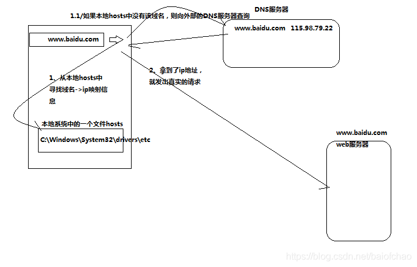

### DNS 域名 IP关系

- 名称解释
    
    - dns
  
    ```text
  DNS是Domain Name System的缩写，即域名系统。其实，DNS是internet的一项服务，
  一般叫域名服务或者域名解析服务，主要提供网站域名与IP地址的相互转换的服务。
  
  域名解析分为正向解析与反向解析，正向解析是将主机名转换成IP地址的过程，
  
  域名的反向解析是将IP地址转换成主机名的过程。通常我们很少需要将IP地址转换成主机名。
  
  其中，反向解析经常被一些后台程序使用，用户看不到。
    ```
  
    - 图解
  
       

- DNS、IP与域名

```text
显然，一串数字类型的IP地址是不容易被使用者记住的，而域名因为带有某些特定的意义而容易被人们记住。
所以，域名作为IP地址的“助记符”，起了相当重要的作用。

但是，想实现全世界的电脑互联，即需要是让每一台计算机都把全世界的计算机的IP地址和域名对应起来，
很明显这是不现实的，因此要有一个系统专门做这件事，这就是DNS服务。
```

- DNS工作的流程

```text
任何计算机如果需要连接internet网，那么，首先需要设置一些关于DNS的信息。

您的电脑需要借助于Internet上的某台域名服务器帮助进行域名查询。

所以您首先需要设置您的电脑，在需要进行域名查询时，向哪个服务器发出询问。

Internet上有许许多多域名服务器，您可以选任何一台作为您首选的域名服务器。

也就是说，您要告诉您的电脑，当需要进行域名查询时，首先去问哪一台域名服务器。

域名服务器接收到您的电脑的查询请求，它会帮助您进行查询，然后将结果返回您的电脑。
为了获得最快的响应，一般选择与您的电脑有最好的连接的服务器。

一般的电脑上，其实已经不用在设置了，
在>本地连接>属性>internet协议（TCP/IP）>自动获得DNS服务器后者手动添加首选DNS与备选DNS。

```

- 检查DNS出错

```text
一个域名要想能够被Internet上的用户访问到，必须得到正常的域名服务。这包括：

（1）在根服务器中有记录，这实际上就是进行了域名的注册；

（2）在“权威性的”域名服务器上有记录，即它们为您的域名提供了域名解析服务。

这些“权威性的”服务器，就是登记在根服务器中，指定为您的域名提供“权威性”

服务的服务器。“权威性的”域名服务器中记录了一个域名下的多个主机的IP地址，
如www主机、ftp主机、mail主机等，还有该域名的电子邮件如何投递的记录、上述的失效期等。
可能给该域名本身也指定一个IP地址，我们创联万网就是这样做的，其好处就是让用户访问您的网站时，不用写“www”也可以访问得到。

一个域名如果得到了正确的域名服务，那么在世界上的任何地方，Internet用户使用各种软件都能够查询到，
如浏览器、telnet、ftp、ping等。值得指出的是，即使一个域名得到了正确的解析服务，
但如果该域名相应的服务器未正常工作（例如没有开机、当机或服务不正常），您仍然访问不到它们。

判别它们的方法很简单，因为您的机器的给您的报告不同：域名解析服务不正常时，
结果是：找不到该主机；而服务器不正常得到的回答是：主机没有响应。

```